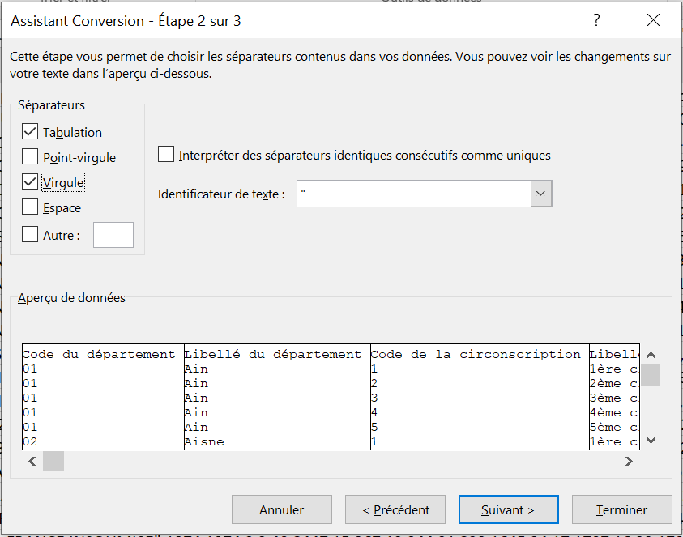
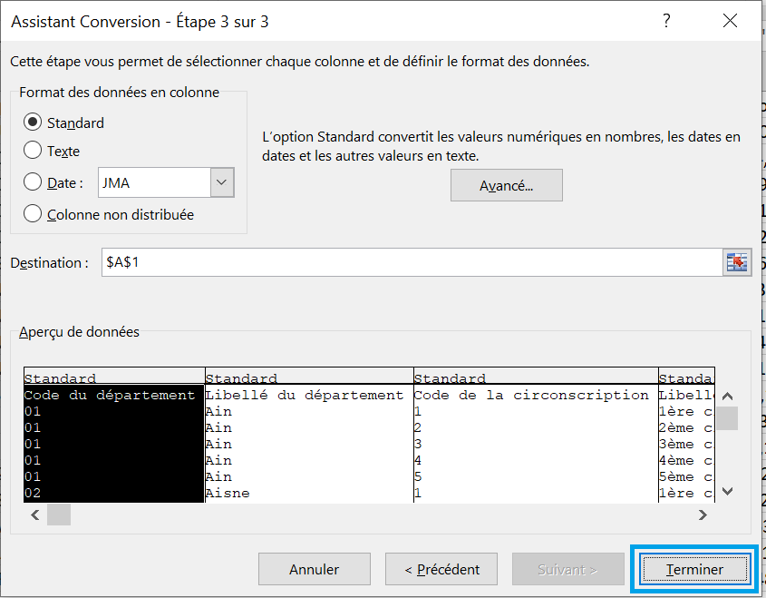

```{r setup, include=FALSE, message=FALSE, warning=FALSE}
knitr::opts_chunk$set(echo = TRUE)
knitr::opts_chunk$set(fig.align = "center", out.width = "75%")
library(knitr)
#date: "`r format(Sys.time(), '%d %B %Y')`"
```


# Pourquoi vouloir transformer les fichiers électoraux ?

## Présentation des fichiers du Ministère de l'Intérieur

Le bureau des élections au sein du Ministère de l'Intérieur met à disposition du public (la communauté scientifique, les journalistes, etc.) les informations sur les srutins électoraux transmis par chaque préfecture et sous-préfecture après chaque élection, via la plateforme de données publiques de l'administration française <https://www.data.gouv.fr/fr/>.

Il est nécessaire de s'assurer que le jeu de données provienne du Ministère de l'Intérieur. En effet, nombre de jeux de données sur les résultats électoraux présents sur cette plateforme sont déposés par des collectivités locales ou des services préfectoraux mais n'ont été ni certifiés ni consolidés par le bureau des élections au Ministère. Deux formats de restitution des résultats sont disponibles à l'utilisateur au téléchargement : soit le format Excel propriétaire (.xls), soit le format texte (.txt).

{width=75%}

### Remarques sur la structure des données

Quand on télécharge les résultats sous format Excel, on découvre qu'un certain nombre de colonnes du tableau ne comporte pas de noms à la 1ère du fichier. Il s'agit des noms des colonnes pour les listes n°2 et suivantes des candidatures en lice. Les colonnes du tableau n'ont pas toujours de noms en en-tête de fichier. Dans l'exemple ci-dessous des résultats des élections européennes en 2019 au niveau des départements, toutes les colonnes de A à W ont un nom d'en-tête, les suivantes n'ont pas de nom.

{width=75%}

Le fichier tel qu'il est construit n'est pas directement exploitable pour des traitements statistiques ou cartographiques par exemple. Le tableau est de largeur variable pour chaque ligne du jeu de données. En règle générale, comme l'offre électorale dans un échelon géographique donné diffère presque toujours d'un autre échelon, il en résulte que le tableau n'a pas les mêmes champs de l'offre électorale d'une ligne à l'autre. Donc, chaque ligne du tableau a un nombre variable d'informations données sur les listes des candidats et leurs scores obtenus. 

Il n'est pas immédiat de pouvoir effectuer des opérations arithmétiques sur les nombres de voix obtenues par les différentes listes de candidats sur un tel fichier. C'est pourquoi il faut transformer ce fichier en un tableau sous forme de matrice des voix pour chaque nuance politique qui soit uniforme pour toutes lignes du tableau.


# Transformer le fichier à l'aide de l'application `LireInteractif`

## Introduction du package `LireMinInterieur`

Le politologue Joël Gombin a developpé le package [LireMinInterieur](https://github.com/joelgombin/LireMinInterieur), disponible non pas sur le CRAN mais sur le dépôt Github^[https://github.com/joelgombin/LireMinInterieur] de l'auteur, qui propose un outil très utile pour nettoyer et mettre en forme les résultats électoraux du Ministère de l'Intérieur.

On l'installe depuis la console R avec la commande :

```{r install_api, eval=FALSE}
library(devtools)
install_github("joelgombin/LireMinInterieur")
```


## Application `LireInteractif`

Il existe une application développée dans `Shiny` pour transformer les fichiers du Ministère, c'est `LireInteractif`. On charge en mémoire le package `LireMinInterieur` et on lance l'application par la commande :

```{r lireinteractif, eval=FALSE}
library(LireMinInterieur)
lireInteractif()
```

Dans la fenêtre de l'application, on peut voir dans le panneau de gauche les informations entrées par l'utilisateur et dans celui de droite une vue du fichier électoral avant et après sa transformation.

```{r apercu_api, echo=FALSE, fig.cap="Aperçu de l'application lireInteractif", out.width="75%"}

```

### Import du tableau à transformer

Dans le panneau de gauche, l'utilisateur indique d'abord charge le fichier .csv qu'il veut transformer en précisant le type de séparateur de colonnes (par défaut la virgule) et le séparateur décimal (par défaut la virgule). Le chargement du fichier est bien effectué à cette étape quand le message "Upload complete" est affché^[La taille du fichier à lire ne doit pas dépasser la limite maximale de chargement fixée à 100 Mo. Cette limite peut être modifiée dans les options de Shiny, options(shiny.maxRequestSize=**100**\*1024^2)]. Ensuite quand l'utilisateur clique sur le bouton `Lire le jeu de données`, le panneau de droite affiche le fichier importé avant sa transformation.

```{r load_file, echo=FALSE, fig.cap="Import du fichier à transformer"}

```

Après avoir lu le fichier, il apparaît une nouvelle zone de paramètres à renseigner dans le panneau de droite. Cette zone requiert les informations suivantes :

  - les colonnes à conserver dans le fichier en l'état. Choisir dans le menu déroulant les noms des colonnes que l'on souhaite conserver dans le fichier transformer ;
  - les nouveaux noms à attribuer aux colonnes choisies (accepter par défaut les noms proposés). A minima les colonnes *Inscrits* et *Exprimés* sont requises ;
  - la première colonne du fichier qui contient le code nuance politique ;
  - le nombre de colonnes situées entre les colonnes contenant le code nuance politique (par défaut 7) ;
  - le nombre de colonnes du fichier qui séparent les colonnes avec les nuances politiques et les colonnes avec le nombre de suffrages exprimés (par défaut 3)

```{r avant_transfo, echo=FALSE, fig.cap="Paramètres pour la transformation du fichier", out.width="30%"}

```

Enfin, l'utilisateur peut appuyer sur le bonton `Transformer le fichier` situé en bas du panneau pour afficher dans le panneau de droite le fichier transformé.

```{r apres_transfo, echo=FALSE, fig.cap="Affichage du fichier après transformation"}

```

### Export du tableau transformé

L'utilisateur peut télécharger le fichier transformé en cliquant sur le bouton `Télécharger` situé en bas à gauche du panneau de droite sous le fichier. Le fichier est téléchargé sous le répertoire indiqué par l'utilisateur au format csv.

```{r telecharger, echo=FALSE, fig.cap="Télécharger le fichier transformé"}

```


# Annexes

## Ouvrir un fichier csv dans un tableur

Pour ouvrir un fichier .csv comme celui exporté par cette app dans un tableur Excel, on déclare les colonnes du fichier et on choisit lesquelles on conserve dans le menu `Données\Convertir` de Excel. Ensuite, avec l'aide de l'assistant conversion, on peut sélectionner comment sont stockées les données dans le fichier :

  - Délimité (les colonnes du fichier sont séparés par un caractère spécial, la virgule, le point-virgule, etc.), c'est cette option qui est retenue ;
  - Largeur fixe (les champs sont rangées en colonne de largeur fixe et séparés par des espace)

```{r xl_conversion_1, echo=FALSE, out.width="50%"}

```

Ensuite, après avoir choisi l'option délimité à l'étape 1, il faut indiquer quel est le type de séparateur de colonnes du fichier csv. On coche le séparateur de la virgule et on clique sur le bouton suivant. 

```{r xl_conversion_2, echo=FALSE, out.width="50%"}

```

A la dernière étape, on peut choisir dans quel format sont converties les données du fichier. Les formats possibles de lecture/conversion des données sont le format standard, le format texte, le format date. Il est aussi possible de choisir de ne pas retenir telle ou telle colonne en sélectionnant l'option `colonne non distribuée`. Ici, on accepte les formats choisis par défaut et on clique sur le bouton `Terminer`.

```{r xl_conversion_3, echo=FALSE, out.width="50%"}

```

On obtient le fichier transformé en matrice des voix exporté dans Excel pour d'autres calculs.


## La fonction `lire`

### Définition

Pour aller plus loin, il peut être utile de connaître la fonction `lire` qui est à la base de l'application sur la transformation des fichiers électoraux du Ministère de l'Intérieur.

La fonction `lire` est utile pour transformer les fichiers de résultats électoraux diffusés par le ministère de l'Intérieur français, lorsque l'offre électorale n'est pas homogène sur l'ensemble du territoire (législatives, européennes, cantonales, régionales...). Pour ce faire, les résultats sont agrégés en fonction des étiquettes attribuées par le ministère de l'intérieur.

La fonction `lire(X, keep, col, keep.names, gap)` est définie avec les 5 paramètres suivants :

  - *X*, le data.frame d'origine importé depuis un fichier plat CSV généralement ;
  - *keep*, un vecteur indiquant les numéros (ou les noms) des colonnes de X qui sont à conserver telles quelles. Les colonnes Inscrits et Exprimés sont requises ;
  - *col*, un vecteur indiquant le numéro des colonnes contenant les étiquettes de nuances politiques à partir desquelles les résultats sont agrégés. En général, leur espacement est régulier et peut s'écrire sous la forme d'une séquence de nombres seq(10, 100, 10) ;
  - *keep.names*, le nom à donner aux colonnes retenues. Par défaut, c'est le nom d'origine des colonnes ;
  - *gap*, le nombre de colonnes intercalées entre la colonne des étiquettes et celle du nombre de voix. Par défaut 3

La fonction retourne un data.frame qui contient en plus des colonnes retenues par l'argument *keep.names*, une colonne pour chaque nuance politique du nombre total de voix, une colonne avec le score rapporté aux inscrits et aux exprimés. Enfin, pour chaque nuance, une colonne indique le nombre de candidats (ou de listes) qu'il y avait dans la circonscription territoriale.

### Algorithme détaillé de `lire`

Plus en détail, la fonction `lire` réalise l'algorithme suivant :

```{r, eval=FALSE}
lire <- function(X, keep, col, keep.names = names(res1), gap=3) {
  # Etape 0 : conversion des colonnes de type factor en colonne de type character
  # On s'assure qu'il n'y a pas de factors qui traînent mais que des characters
  X[,sapply(X, is.factor)] <- as.character(X[, sapply(X, is.factor)])  
  
  # Etape 1 : on crée un df dans lequel on va stocker les résultats
  res1 <- X[, keep]
  names(res1) <- keep.names
  
  # Etape 2 : on récupère l'ensemble des nunances possibles
  nuances <- unique(unlist(X[, col]))[!seq_along(unique(unlist(X[, col]))) %in% match("",unique(unlist(X[, col])))]
  nuances <- na.omit(nuances)
  
  # on crée une matrice pour stocker les étiquettes politiques et une matrice pour stocker les nombres de voix
  etiquettes <- as.matrix(X[, col])
  valeurs <- as.matrix(X[, col + gap])
  
  # Etape 3 : on crée une matrice initialisée à 0 pour stocker les résultats intermédiaires
  candidats <- paste("NbCand", nuances, sep="")
  res2 <- matrix(0, nrow=dim(res1)[1], ncol=length(nuances) + length(candidats), dimnames=list(c(), c(nuances, candidats)), byrow=TRUE)
  
  # Etape 4 : on calcule les nombres totaux des voix et nombres de candidats pour chaque nuance et chaque étiquette
  for (i in 1:length(nuances)) {
    for (j in 1:dim(etiquettes)[1]) {
      index <- which(etiquettes[j, ] == nuances[i])
      res2[j, nuances[i]] <- sum(valeurs[j, index], na.rm = TRUE)
      res2[j, candidats[i]] <- sum(length(index), na.rm = TRUE)
    }
  }  
  
  # Etape 5 : on adjoint le df res1 avec la matrice des résultats intermédiaires
  res <- cbind(res1, res2)
  
  # Etape 6 : on ajoute les scores des nuances rapportés aux inscrits et aux exprimés
  res[, paste(nuances, ".ins", sep="")] <- res[, nuances] / res[, "Inscrits"] * 100
  res[, paste(nuances, ".exp", sep="")] <- res[, nuances] / res[, "Exprimés"] * 100
  
  return(res)
}
```


### Application sur le jeu de données `Eur2014Dpts`

Le package fournit un jeu de données pour exemple, il s'agit des résultats des élections européennes en 2014 au niveau départemental^[http://www.data.gouv.fr/fr/dataset/elections-europeennes-2014-resulta-1].

```{r data_euro14}
library(LireMinInterieur)
data(Eur2014Dpts)
head(names(Eur2014Dpts), 50)
```

La fonction se lance directement en ajoutant les arguments `keep`, `col` et `keep.names` avec la commande suivante :

```{r exemple_euro14}
res <- lire(Eur2014Dpts, keep = c(2,4,5,7,9,12,15), col=c(seq(19,229,7)), keep.names=c("CodeDpt", "Inscrits", "Abstentions","Votants", "Blancs", "Nuls", "Exprimés"))
```

Le résultat de la fonction `lire` sur les données d'exemple est stocké dans le data.frame `res` qui se présente ainsi :

```{r structure_res}
str(res)
```
